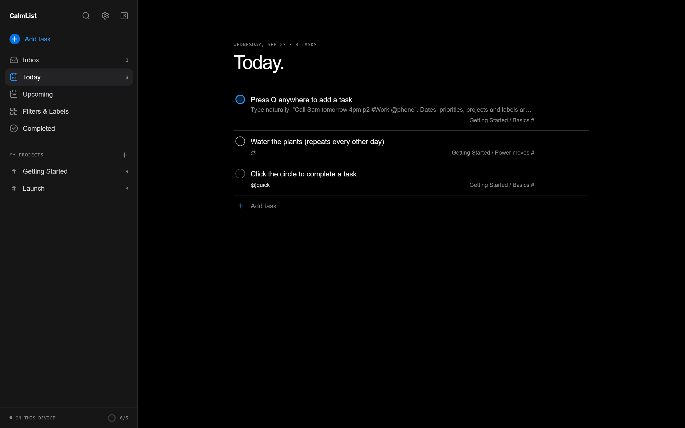
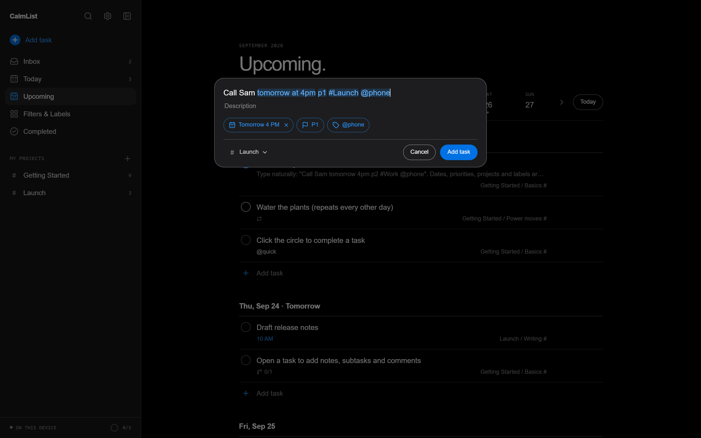
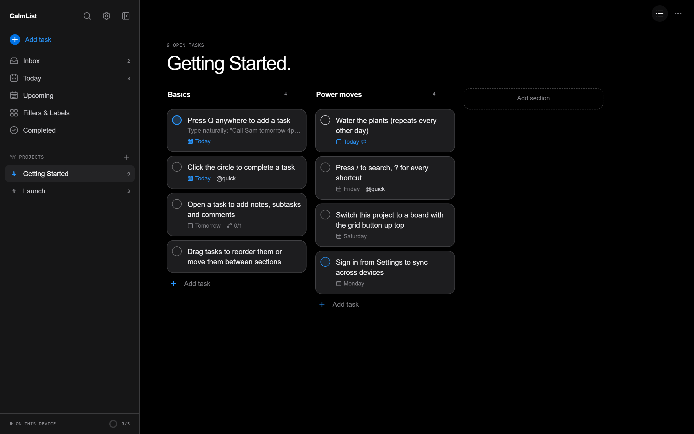
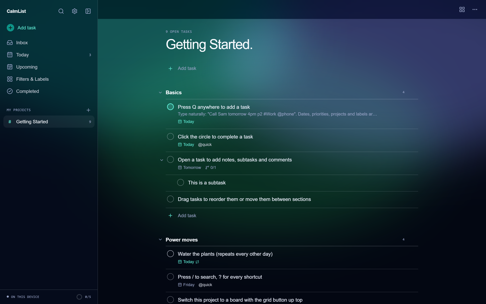
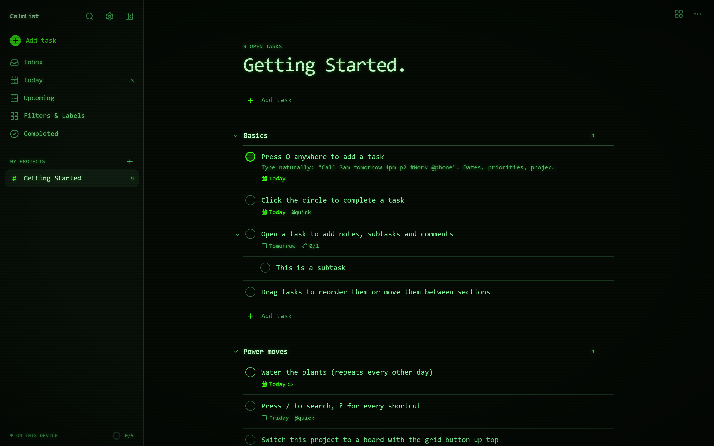
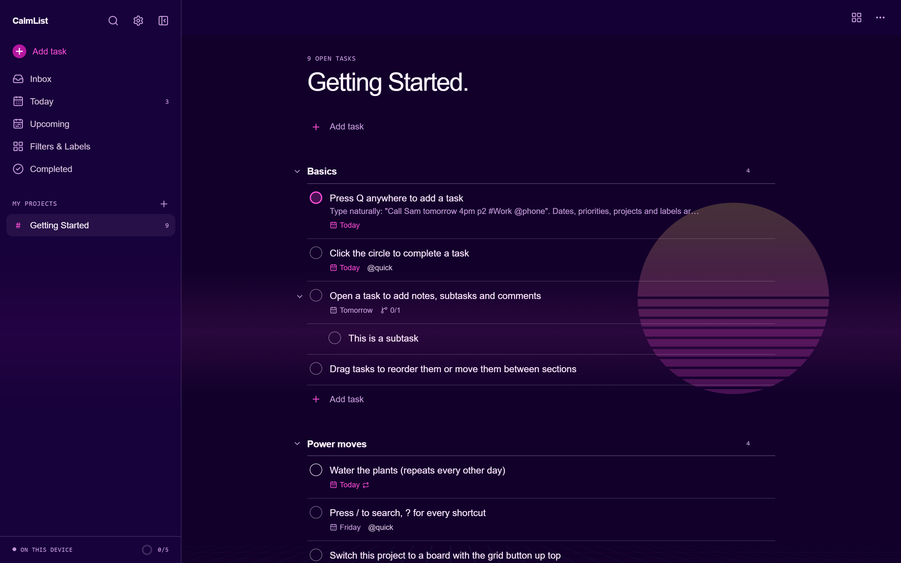
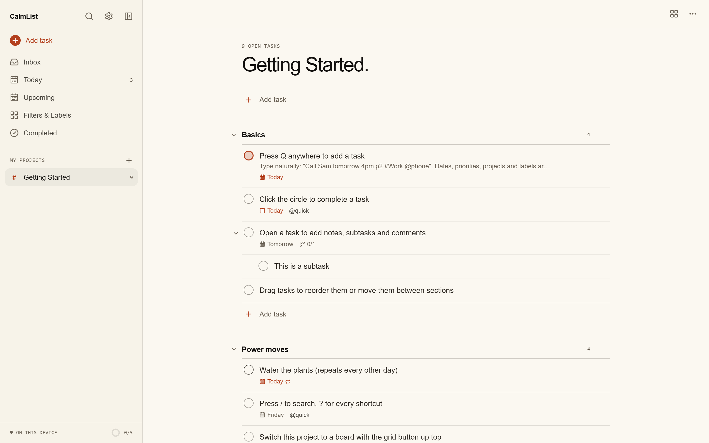

<div align="center">

# CalmList.

**Plan less. Finish more.**

A calm, keyboard-first task manager inspired by Todoist.<br />
Local-first in the browser, with 48 themes and sync through Supabase or a server you host yourself.

[**Open the app**](https://corund207.github.io/CalmList/app/) · [**Website**](https://corund207.github.io/CalmList/) · [Themes](#themes) · [Sync](#sync-options) · [Shortcuts](#keyboard-shortcuts)

[](https://github.com/corund207/CalmList/actions/workflows/pages.yml)




</div>

## Features

| | |
| --- | --- |
| **Smart quick add** | Type `Call Sam tomorrow at 4pm p1 #Work @phone` and the date, time, priority, project and label are picked out and highlighted as you type. |
| **Today & Upcoming** | Overdue tasks up top with one-click reschedule, a week strip, and day-by-day planning. |
| **Repeating tasks** | `every day`, `every weekday`, `every other week`, `every mon, fri at 9am`, `every! 3 days` (counts from completion). |
| **Projects, sections, boards** | Any project can be a list or a kanban board. Drag tasks to reorder or move them between sections. |
| **Sub-tasks, notes, comments** | A full task view with descriptions, deadlines, sub-tasks and a comment thread. |
| **Labels & filters** | Saved filters in a Todoist-style query language, validated live with a match count. |
| **Command palette** | Press <kbd>/</kbd> to find any task, project, label, filter or theme, or run a query on the spot. |
| **Undo** | Completing, deleting and bulk rescheduling all come with an Undo toast. |
| **Progress** | Daily goal, streak, a 14-day chart and an activity log of what you finished. |
| **48 themes** | Dark, light, dynamic (follows the clock or the seasons), animated (aurora, starfield, synthwave, rain…) and niche (Nord, Dracula, Terminal, Pocket…), plus a custom accent colour. |
| **Sync your way** | Works offline in the browser. Connect Supabase Cloud, a self-hosted Supabase, or the bundled CalmList server; offline edits queue and send on reconnect. |
| **Integrations** | Export dated tasks to Google, Apple or Outlook Calendar (.ics) and import Todoist projects (CSV). |
| **Yours** | Export and import JSON at any time. MIT licensed. |

<table>
  <tr>
    <td width="50%"></td>
    <td width="50%"></td>
  </tr>
</table>

## Themes

Settings → **Appearance** has a gallery of 48 themes. Pick one, or choose **Match system** and assign a light and a dark theme. CI checks every palette for text contrast (4.5:1 for body text) and legible button labels.

| Group | Themes |
| --- | --- |
| **Dark** | Calm Dark (the design system default), Midnight, Graphite, OLED Mono, Forest Night, Plum, Ember |
| **Light** | Calm Light, Paper, Sky, Sage, Sand, Lilac |
| **Dynamic** | Daylight (dawn, day, golden hour, dusk, night), Night Shift (warm dark after 8 pm), Seasons, Daily Mix |
| **Animated** | Aurora, Starfield, Synthwave, Rainy Window, Lava Lamp, Digital Rain, Fireflies, Snowfall, Clouds, Ocean, Sakura, Dreamy |
| **Niche** | Terminal, Amber CRT, Pocket, Blueprint, Nord, Dracula, Gruvbox, Solarized Dark and Light, Catppuccin Mocha and Latte, Rosé Pine, Tokyo Night, Vaporwave, Coffee, E-Ink, Newsprint, Bubblegum, High Contrast |

Animated backdrops pause when the tab is hidden, cap the pixel ratio, and switch off entirely under *reduced motion* or with the **Animate theme backdrops** toggle. Type `theme` in the command palette to switch without opening settings.

<table>
  <tr>
    <td width="50%"></td>
    <td width="50%"></td>
  </tr>
  <tr>
    <td width="50%"></td>
    <td width="50%"></td>
  </tr>
</table>

## Sync options

Open **Settings → Sync** and pick where your tasks live.

| Option | Best for | Set up |
| --- | --- | --- |
| **This device** | Privacy, offline use, trying it out | Nothing. It's the default. |
| **Supabase Cloud** | Syncing with no servers to run | Create a project, apply the schema, paste the URL and anon key |
| **Self-hosted Supabase** | Owning everything, with Supabase's auth and realtime | `npm run supabase:selfhost` |
| **CalmList server** | The smallest possible footprint | `docker run` or `npm start` |

### Supabase Cloud

1. Create a project at [supabase.com](https://supabase.com/dashboard/new).
2. Apply the schema, either way:
   - **SQL editor:** paste [`supabase/migrations/20260923000000_calmlist.sql`](supabase/migrations/20260923000000_calmlist.sql) and run it. The app's *Copy Setup SQL* button copies it for you.
   - **CLI:** `npm run supabase:link -- --project-ref <ref>`, then `npm run supabase:push`.
3. In CalmList, open **Settings → Sync → Supabase**, paste the project URL and the **anon public** key (Project Settings → API), press *Test Connection*, then create an account.

The schema is one table, `calmlist_items`, with row-level security (people only see their own rows), a revision trigger for incremental sync, and a realtime publication so devices update live. Hosted Supabase asks new users to confirm their email by default; you can turn that off under Authentication → Providers → Email.

### Self-hosted Supabase

Needs Docker (with the compose plugin) and git.

```bash
npm run supabase:selfhost -- --url https://tasks.example.com --app-url https://you.github.io/CalmList/app/
```

The script:

- fetches Supabase's official Docker setup into `supabase-selfhost/`
- generates every secret: Postgres password, JWT secret, signed anon and service-role keys, dashboard login, and encryption keys
- turns on email auto-confirm, since there's no SMTP by default (pass `--smtp` to keep confirmations)
- starts the stack and applies the CalmList schema
- prints the URL and anon key to paste into the app

Re-running keeps the existing secrets. `--no-start` only writes the configuration. Put HTTPS in front of port 8000 (Caddy, nginx or a Cloudflare Tunnel) before exposing it.

### Pointing the hosted app at your Supabase

In the repo's **Settings → Secrets and variables → Actions → Variables**, set `SUPABASE_URL` and `SUPABASE_ANON_KEY`. The Pages build then pre-fills the Supabase option. Also set the `SUPABASE_PROJECT_REF` variable and the `SUPABASE_ACCESS_TOKEN` and `SUPABASE_DB_PASSWORD` secrets, and CI will run `supabase db push` on every push to `main`.

### CalmList server

The bundled server is one Node process with one SQLite file (`node:sqlite`, no native modules). It also serves the built web app, so a single container is the whole product.

```bash
docker build -t calmlist .
docker run -d -p 8787:8787 -v calmlist:/data --name calmlist calmlist
```

Or from source: `npm install && npm run build && npm start` (copy `server/.env.example` to `server/.env` first to change settings).

| Variable | Default | Purpose |
| --- | --- | --- |
| `PORT` | `8787` | Port for the API and the bundled app |
| `DATABASE_PATH` | `calmlist.db` (`/data/calmlist.db` in Docker) | SQLite file; keep it on a persistent volume |
| `CORS_ORIGIN` | `*` | Comma-separated origins allowed to call the API, e.g. `https://corund207.github.io` |
| `STATIC_DIR` | `../../web/dist` | Built web app to serve, relative to `server/src` |

Put it behind HTTPS before using it for real accounts. To use it from the GitHub Pages app, set `CORS_ORIGIN=https://corund207.github.io`, then choose **Settings → Sync → CalmList server** and enter its URL.

<details>
<summary>API reference</summary>

| Method | Path | |
| --- | --- | --- |
| `POST` | `/api/auth/signup` | `{ email, password, name? }` → `{ token, user }` |
| `POST` | `/api/auth/login` | `{ email, password }` → `{ token, user }` |
| `POST` | `/api/auth/logout` | Revokes the bearer token |
| `GET` | `/api/me` | The signed-in user |
| `GET` | `/api/sync?since=<rev>` | Changes after a revision, deletions as `data: null` |
| `POST` | `/api/sync` | `{ changes: [{ kind, id, data \| null }] }` → `{ rev }` |
| `GET` | `/api/export` | Everything the account owns |
| `DELETE` | `/api/account` | Deletes the account and its data |

Passwords are hashed with scrypt; sessions are random 256-bit bearer tokens stored only as SHA-256 hashes and expire after 90 days. Auth endpoints are rate-limited.

</details>

## Integrations

Under Settings → **Integrations**:

- **Google, Apple and Outlook Calendar:** download every open, dated task as an `.ics` file, with repeats written as `RRULE`s, and import it into your calendar.
- **Todoist:** in Todoist, choose a project's *Export as a template → CSV*, then import one or many files. Sections, sub-tasks (from indentation), labels, priorities, dates and comments come across.
- **JSON:** Settings → Data exports and imports everything.

## Quick start

Requires **Node 24+**.

```bash
git clone https://github.com/corund207/CalmList.git
cd CalmList
npm install
npm run dev            # web app on http://localhost:5173 (local mode)
npm run dev:server     # CalmList server on http://localhost:8787 (optional, proxied at /api)
```

With both running, open **Settings → Sync → CalmList server**, leave *Server* blank and create an account.

| Script | What it does |
| --- | --- |
| `npm run dev` | Vite dev server for the web app |
| `npm run dev:server` | CalmList server with file watching |
| `npm run build` | Production build of the web app (`web/dist`) and server typecheck |
| `npm start` | Runs the server, which also serves `web/dist` on the same port |
| `npm test` | Web unit tests (Vitest) and API tests (`node:test`) |
| `npm run typecheck` | TypeScript across both workspaces |
| `npm run supabase:selfhost` | Sets up and starts a self-hosted Supabase for CalmList |
| `npm run supabase:link` / `supabase:push` | Links a hosted Supabase project and applies the schema |

## Quick add syntax

| Type | Example | Result |
| --- | --- | --- |
| Date | `today` `tomorrow` `friday` `next week` `in 3 days` `oct 5` `12/31` `2026-11-02` | Due date |
| Time | `at 4pm` `9:30am` `17:00` `at noon` | Due time (a bare time means today, or tomorrow if it has passed) |
| Repeat | `every day` `every weekday` `every other week` `every mon, fri` `monthly` `every! 3 days` | Recurrence |
| Priority | `p1` `p2` `p3` `p4` | Priority (P1 is most urgent) |
| Project | `#Work` `#Home Renovation` | Project (created if new) |
| Section | `/Q4 Plans` | Section in the chosen project |
| Label | `@phone` | Label (created if new) |
| Deadline | `{oct 30}` | Deadline, separate from the due date |

## Filter syntax

Combine terms with `&` (and), `|` or `,` (or), `!` (not) and parentheses.

| Term | Matches |
| --- | --- |
| `today` `tomorrow` `overdue` `no date` | By due date |
| `7 days` `next 14 days` | Due within the next N days |
| `due before: next week` `due after: oct 1` | Relative to any date phrase |
| `p1` … `p4` `no priority` | By priority |
| `#Work` `@phone` `@home*` `/Writing` | Project, label (with wildcard), section |
| `recurring` `subtask` `no labels` `deadline` | By shape |
| `search: invoice` | Text in the name or description |

Example: `(today | overdue) & #Work & !@waiting`

## Keyboard shortcuts

| Key | Action |
| --- | --- |
| <kbd>Q</kbd> | Quick add |
| <kbd>/</kbd> | Search, commands and themes |
| <kbd>G</kbd> then <kbd>I</kbd> / <kbd>T</kbd> / <kbd>U</kbd> / <kbd>F</kbd> / <kbd>C</kbd> | Inbox, Today, Upcoming, Filters & Labels, Completed |
| <kbd>M</kbd> | Toggle the sidebar |
| <kbd>?</kbd> | Show all shortcuts |
| <kbd>Enter</kbd> / <kbd>Ctrl</kbd>+<kbd>Enter</kbd> | Save a task |
| <kbd>Esc</kbd> | Close or cancel |

## How it works

```
web/                 React 19 + Vite + TypeScript
  src/lib/           pure logic: date parser, quick add, recurrence, filters, .ics, Todoist CSV (unit tested)
  src/store/         Zustand store, sync providers (local, CalmList, Supabase), actions with undo
  src/themes/        48 themes, the palette → token engine, animated backdrops, the gallery
  src/components/    task rows, editor, pickers, dialogs, drag and drop, settings
  src/views/         Today, Upcoming, Project/Board, Filters & Labels, Completed, Search
server/              Hono on Node 24, node:sqlite, runs TypeScript natively
supabase/            Supabase CLI config and the schema migration
scripts/             supabase-selfhost.mjs
site/                GitHub Pages landing page
```

Every record (task, project, section, label, filter, comment, completion event) is a JSON document. The client applies changes locally first and computes their inverse for undo. Remote providers share one backend, with an offline cache and an outbox, and differ only in transport. The CalmList server and Supabase both stamp each write with an increasing revision, so clients pull only what they have not seen, and Supabase also pushes changes over realtime. Conflicts resolve last write wins.

The UI follows the [Jonah Chang design system](https://claude.ai/artifact/FcShiF9BeJoJ54daksaej8): pure black ground, graphite surfaces, one blue for action, pill buttons, hairline lists and the SF system stack. Priority is shown by ring weight rather than extra hues. Other themes swap the palette through the same tokens.

## Deployment status

| Piece | Where | State |
| --- | --- | --- |
| Website and app | [corund207.github.io/CalmList](https://corund207.github.io/CalmList/) | Deploys on every push to `main` |
| Supabase project | `calmlist` in the PersonalProgects org, us-east-2 (`ddvtufcbrvzjislojlqp`) | Schema applied, row-level security and realtime on |
| Hosted app → Supabase | Actions variables `SUPABASE_URL`, `SUPABASE_ANON_KEY` | Set: the Sync tab comes pre-filled |

## What you still need to do

1. **Create your account.** Open the [app](https://corund207.github.io/CalmList/app/) → **Settings → Sync → Supabase** → *Create account*. New accounts get a confirmation email; after clicking it, come back and sign in.
2. **Optional: skip email confirmation.** Supabase's built-in email sender is rate-limited, so for a personal instance you may prefer turning off *Confirm email* under Authentication → Providers → Email in the [dashboard](https://supabase.com/dashboard/project/ddvtufcbrvzjislojlqp/auth/providers).
3. **Optional: automatic migrations.** Add the Actions variable `SUPABASE_PROJECT_REF=ddvtufcbrvzjislojlqp` and the secrets `SUPABASE_ACCESS_TOKEN` (from [account tokens](https://supabase.com/dashboard/account/tokens)) and `SUPABASE_DB_PASSWORD` (in your local, gitignored `supabase/.env.local`). CI will then push new migrations on every merge to `main`.

**Self-hosting instead:** install Docker, run `npm run supabase:selfhost -- --url https://your-domain`, put HTTPS in front of port 8000, and paste the printed URL and anon key into the app. Or deploy the CalmList server image with a volume for `/data`, set `CORS_ORIGIN=https://corund207.github.io`, and choose **Settings → Sync → CalmList server**.

## License

[MIT](LICENSE) © 2026 Jonah Chang
